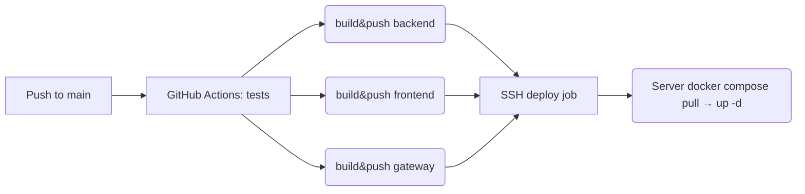

# 📝 Taski программа для планирования задач, развёрнутая на сервере с CI/CD


* **Stack** :  Django 3.2 · DRF 3.12 · PostgreSQL 13 
* **DevOps**:  Docker / Docker Compose · Nginx · Gunicorn 
* **CI/CD** :  GitHub Actions &rarr; Docker Hub &rarr; Prod-server 

## Содержание
1. [Быстрый старт](#быстрый-старт)
2. [Локальная разработка](#локальная-разработка)
3. [Тесты](#тесты)
4. [Сборка контейнеров](#сборка-контейнеров)
5. [Развёртывание на сервере](#развёртывание-на-сервере)
6. [CI/CD-пайплайн](#cicd-пайплайн)
7. [Переменные окружения](#переменные-окружения)
8. [Полезные команды](#полезные-команды)
9. [Контакты](#контакты)
---

## Быстрый старт
```bash
git clone git@github.com:Oleg202020/taski-docker.git
cd taski-docker
cp .env.example .env  # отредактируйте значения
docker compose up --build
```

Сервис доступен на http://localhost:8000/.

## Локальная разработка

```bash
poetry install  # или pip install -r backend/requirements.txt
cd backend
python manage.py migrate
python manage.py runserver
```

## Тесты

```bash
docker compose run --rm backend python manage.py test
# или локально:
cd backend && python manage.py test
```

---

## Сборка контейнеров

**Образ**	| **Команда локальной сборки**
------------|------------------------------
backend	    | 'docker compose build backend'
frontend	| 'docker compose build frontend'
gateway	    |'docker compose build gateway'

Все образы публикуются в Docker Hub с тегом latest.

## Развёртывание на сервере

* 1 **Предусловия**
   * Ubuntu 22.04 LTS
   * Docker >= 24, Docker Compose v2
   * Открытый порт 80 (HTTP)

* 2 **Подготовка**
```bash
ssh <user>@<server-ip>
sudo apt update && sudo apt install -y docker.io docker-compose-plugin
sudo usermod -aG docker $USER && newgrp docker
```

* 3 **Клонируем репозиторий и копируем compose-файл**
```bash
git clone git@github.com:Oleg202020/taski-docker.git
cd taski
# production-файл уже содержит образы из Docker Hub
cp docker-compose.production.yml docker-compose.yml
```

* 4 **Создаём** '.env' (см. раздел [Переменные окружения](#переменные-окружения)).

* 5 **Запуск**
```bash
docker compose pull           # тянем свежие образы
docker compose up -d          # первый запуск
docker compose exec backend python manage.py migrate
docker compose exec backend python manage.py collectstatic --no-input
```

* 6 **Обновление** — просто пушим в ветку 'main'; GitHub Actions соберёт новые образы и задеплоит через SSH-step.

# HTTPS (опционально)
Используйте **Caddy** или 'certbot' для автоматического получения и обновления сертификатов. В 'nginx.conf' достаточно заменить блок 'server' на 443 и подключить '.crt'/'.key'.

## CI/CD-пайплайн

Все секреты ('DOCKER_*', 'HOST', 'SSH_KEY', т.д.) хранятся в GitHub Settings → Secrets.

## Переменные окружения

 Переменная	  | Описание	| Пример
--------------|-------------|---------------
'POSTGRES_USER'	| Пользователь БД	| 'django_user'
'POSTGRES_PASSWORD'	| Пароль БД	| 'supersecret'
'POSTGRES_DB'	| Имя БД	| 'django_db'
'DB_HOST'	| Хост БД (для Django)	| 'db'
'DB_PORT'	|Порт БД	| '5432'
'ALLOWED_HOSTS'	| Список хостов через запятую	| 'example.com,localhost'
'SECRET_KEY'	| Django SECRET_KEY 	| 'change-me'

## Полезные команды
```bash
# Просмотр логов nginx
docker compose logs -f gateway
# Создать суперпользователя
docker compose exec backend python manage.py createsuperuser
# Обновить статические файлы без даунтайма
docker compose exec backend python manage.py collectstatic --no-input
```

## Контакты

* Автор: Larionov Oleg
* E-mail: jktu2005@yandex.ru
* GitHub: @Oleg202020


```text
---

Что дальше?

* При необходимости можно расширить `TaskView` пермишенами, пагинацией и фильтрацией.
* Для трафика в HTTPS — подключите Let’s Encrypt.
* В `docker-compose.production.yml` можно настроить `restart: always` для всех сервисов.

Удачного диплоя!🚀
```